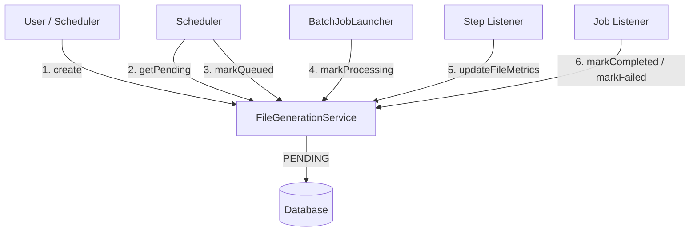

# FileGenerationService - Usage Map

## Overview
`FileGenerationService` is the central service for managing file generation job records in the database. It handles lifecycle state transitions (PENDING -> QUEUED -> PROCESSING -> COMPLETED) and metrics updates.

---

## Where FileGenerationService is Called

### 1. FileGenerationController (REST API)
**File**: `controller/FileGenerationController.java`

*   **Create Record**:
    *   `createFileGeneration(...)`: Called when `POST /generate` is hit. Creates the initial **PENDING** record.
*   **Check Status**:
    *   `getFileGeneration(jobId)`: Called by `GET /getFileGenerationStatus/{jobId}`.
*   **List Pending**:
    *   `getPendingFileGenerations()`: Called by `GET /getFileGenerationsByStatus`.

### 2. FileGenerationScheduler (The Poller)
**File**: `scheduler/FileGenerationScheduler.java`

*   **Fetch Work**:
    *   `getPendingFileGenerations()`: Finds jobs waiting to be run.
*   **Claim Work (Locking)**:
    *   `markQueued(jobId)`: **Crucial**. Atomically transitions status from `PENDING` -> `QUEUED` so no other node picks it up.

### 3. BatchJobLauncher (The Trigger)
**File**: `service/BatchJobLauncher.java`

*   **Start Processing**:
    *   `markProcessing(jobId)`: Transitions `PENDING/QUEUED` -> `PROCESSING` right before handing the job to Spring Batch.
*   **Launch Failure**:
    *   `markFailed(jobId, error)`: If Spring Batch fails to start (e.g., config error), the job is immediately failed.

### 4. DynamicStepExecutionListener (During Batch)
**File**: `batch/DynamicStepExecutionListener.java`

*   **Update Metrics**:
    *   `updateFileMetrics(jobId, processed, skipped, invalid)`: Called at the end of every step (chunk) to persist progress to the database.

### 5. DynamicJobExecutionListener (End of Batch)
**File**: `batch/DynamicJobExecutionListener.java`

*   **Success**:
    *   `markCompleted(jobId)`: Called **only** after the file is successfully finalized (renamed & hashed).
*   **Failure**:
    *   `markFailed(jobId, error)`: Called if the batch job crashes or file finalization fails.

---

## Data Flow Summary



---

## FileGenerationService API Reference

| Method                 | Primary Caller           | Purpose                                                 |
|:-----------------------|:-------------------------|:--------------------------------------------------------|
| `createFileGeneration` | Controller, SchedulerJob | Creates initial `PENDING` record.                       |
| `markQueued`           | FileGenerationScheduler  | Locks a job for execution (`PENDING` -> `QUEUED`).      |
| `markProcessing`       | BatchJobLauncher         | signals job execution start (`QUEUED` -> `PROCESSING`). |
| `updateFileMetrics`    | StepExecutionListener    | Persists record counts (Read/Write/Skip).               |
| `markCompleted`        | JobExecutionListener     | Final success state (Terminal).                         |
| `markFailed`           | *Multiple*               | Final error state (Terminal).                           |

## Key Observations

1.  **State Machine Enforced**: The Service enforces valid transitions (e.g., you cannot go from `FAILED` back to `PROCESSING`).
2.  **Granular Metrics**: Metrics are updated by the **Step Listener**, not the Job Listener, ensuring intermediate progress is saved even if the job crashes later.
3.  **Concurrency Control**: The `markQueued` method acts as a distributed lock for the Poller.
```